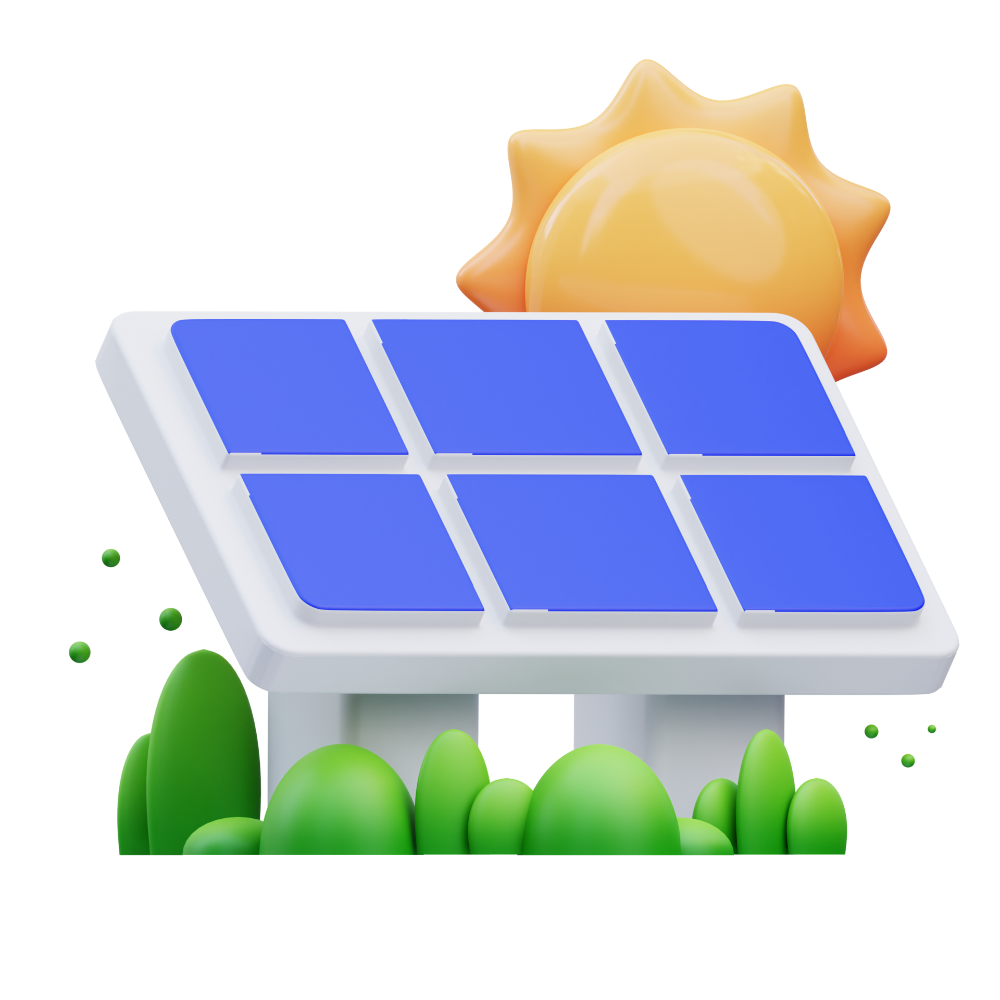

# <a href='https://artools1509.web.app/'>ArTools - Arthur Tools</a>

Software com um conjunto de pequenas ferramentas.

# Tools

## <a href='https://artools1509.web.app/#/CCCP'>CCCP - Conversor de Coordenadas Cartesianas & Polares</a>

Converte tanto de coordenadas cartesianas para coordenadas polares, quanto ao contrário.

- Советских Социалистических Республик (CCCP).

## <a href='https://artools1509.web.app/#/EGS'>EGS - Estimador de Geração Solar</a>

Fornecendo o estado, município e potência instalada, estipula a geração solar.

## <a href='https://artools1509.web.app/#/CS'>CS - Clima Strike</a>

Mostra o clima atual nas cidades onde os mapas de CS são localizados.